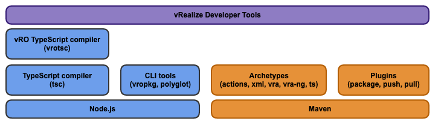

vRealize Developer Tools consists of an extension for Visual Studio Code and a set of Node.js and Maven command line tools.

## Layers

The toolchain consists of components in both Node.js and Maven worlds.

-   Maven
    -   Natively-supported by vRO way to express content as source code
    -   Used for dependency resolution and management
    -   A thin CLI layer with commands for packaging the source code, pushing to or pulling from vRO/vRA servers
    -   Provides templates for generating different types of vRealize projects using the Maven Archetypes toolkit
-   Node.js
    -   TypeScript CLI tools for packaging vRO content, working with the vRO polyglot runtimes (Node.js, Python, PowerShell) and transpiling TypeScript to vRO-compatible JavaScript

## Folder structure

### Visual Studio Code extension

-   **`common`** - code shared between `extension` and `language-server`
-   **`extension`** - The VS Code extension' source; depends on `common` and `language-server` through TypeScript project references
-   **`language-server`** - A Node.js implementation of the [Language Server Protocol (LSP)](https://github.com/Microsoft/language-server-protocol). It analyses type information received from the vRO server and maintains semantic knowledge about a vRO solution implemented in JavaScript. Depends on vRO Hint Plugin that is part of the [vRealize Build Tools](https://flings.vmware.com/vrealize-build-tools) fling. _No longer maintained, still remains for compatibility._
-   **`protocol`** - A set of [Protocol Buffer](https://developers.google.com/protocol-buffers/) message definitions that are used by the vRO language server and the vRO Hint plug-in as a serialization format for communication and storage purposes. _No longer maintained, still remains for compatibility._

### Node.js tooling and libraries

-   **`tools/polyglotpkg`** - Packages Node.js/Python/PowerShell project into Polyglot bundle that can be executed by vRO 8.1+
-   **`tools/vropkg`** - CLI tool and library for transforming vRO content source through multiple forms (`JavaScript source ➡️ XML source ➡️ .package binary`)
-   **`tools/vrotsc`** - allows expressing every type vRO content (workflows, actions, config elements) as TypeScript source code; transpiles TypeScript into vRO-compatible JavaScript and XML ready for consumption by vRO

<!--
### Maven archetypes and CLI tools

-   **`tools/maven/archetypes`** -
-   **`tools/maven/plugins`** -
-   **`tools/maven/repository`** -
-->

### Other

-   **`wiki`** - The documentation vRealize Developer Tools. Changes to this directory are automatically reflected in the [GitHub Wiki](https://github.com/vmware/vrealize-developer-tools/).
