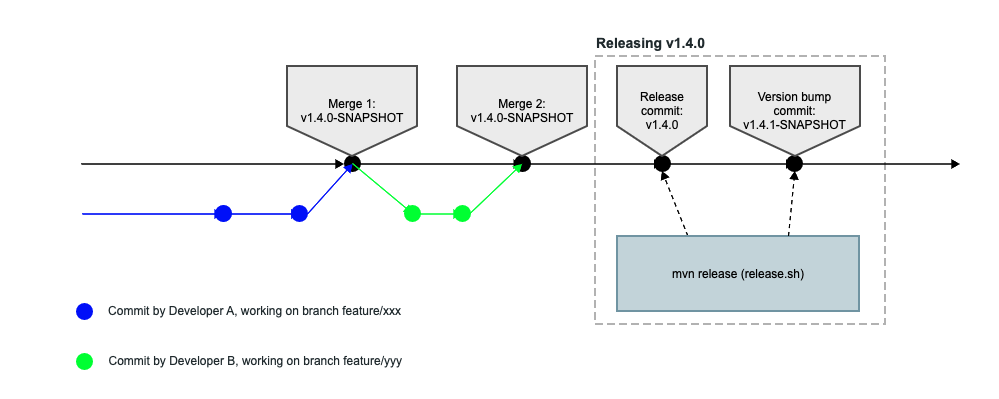

# Git Flow

A standard GitFlow workflow can be applied for the development, versioning and
release of projects under vRDT management.



# Versioning

The version of a project under vRDT management is defined in the `pom.xml` file
in the format: <major>.<minor>.<maintenance>-SNAPSHOT, e.g. 1.2.3-SNAPSHOT.
The format follows the [semantic versioning proposal](https://semver.org/).

The versions are automatically managed, using the Maven release plugin, i.e.
without manually editing the pom.xml. The only commits that will have the
`-SNAPSHOT` removed are the release commits.

The `-SNAPSHOT` artifacts are typically continuously updated during development.
When a project reaches a stable state that can be released, the version is
baked using the Maven release plugin.

# Release

The release process of a project under vRDT management is controlled using a
script - `release.sh`, performing automated steps for:

-   version management of the project and its modules
-   tagging git revisions with the released version
-   auto-committing and auto-pushing released version and revision for the next
    development iteration.

The script has the following arguments:

```
OPTIONS
-v <version>    Specify the version to be released, e.g. 1.4.2. Default - the current dev version without SNAPSHOT.
-n <version>    Specify the next dev version. Default - maintenance increment of the released one with SNAPSHOT
-u <username>   User to be used for SCM.
-i <email>      Impersonate with the provided email. Sets the git user.email temporary.
-r <url>        Repository URL. Assumes the POM property to be set to ${scmDeveloperConnection}
-h              Prints this help.
```

All arguments are optional. The default behavior is releasing the current
snapshot version and incrementing the patch segment of the semantic version.

The `${scmDeveloperConnection}` configuration is defined in the project's POM
file. Refer to the following [documentation](https://maven.apache.org/scm/maven-scm-plugin/usage.html)
for details on how to use the Maven SCM plugin.
